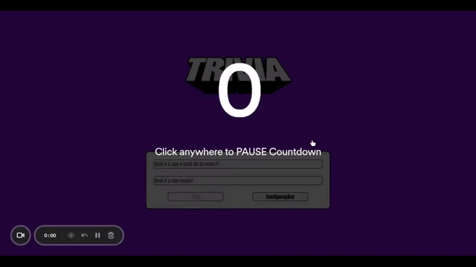

# Projeto 14 - Trivia Game

Oi. Este foi um dos projetos que eu fiz durante meu curso na Trybe. Confira os detalhes dele abaixo.

## Nome do Projeto
Trivia Game (Jogo de Trivia)

## Linguagens e Ferramentas Utilizadas

 - JavaScript
 - HTML
 - CSS
 - Kanban
 - [Biblioteca React](https://pt-br.reactjs.org/)
 - [React Router](https://reactrouter.com/en/main)
 - [Redux](https://redux.js.org/)
 - [React Redux](https://react-redux.js.org/)

## Objetivos do Projeto
Neste projeto foi desenvolvida uma aplicação de jogo de trivia (perguntas e respostas). Ele foi realizado em grupo, e junto comigo realizaram o projeto: [Lizia Towata](https://github.com/LiziaTowata), [Nelson Filho](https://github.com/NelsonFilho1984), [Robson Silva](https://github.com/rm-l), e [Elivelton Machado](https://github.com/El1v). A organização do grupo foi feita por meio do uso da metodologia ágil Kanban, diagramada em um quadro na ferramenta [Trello](https://trello.com/).

 

Assim como o projeto [TrybeWallet](https://github.com/BrunoSayago/projeto-13-TrybeWallet), este projeto colocou em prática os conhecimentos de React em conjunto com o Redux. Entretanto, o principal intuito do projeto era simular uma situação real de mercado de trabalho, onde há necessidade de trabalhar em uma equipe de desenvolvedores, seguindo uma metodologia e um planejamento.

 
Abaixo está um GIF que mostra a aplicação funcionando.
 

 

## Instruções para visualização
Comando para clonar o projeto:
 - `git clone git@github.com:BrunoSayago/projeto-14-TriviaGame.git`
 
Se necessário, instalar as dependências:
 - `npm install`
  
O projeto pode ser visualizado no navegador utilizando o comando:
- `npm start`
